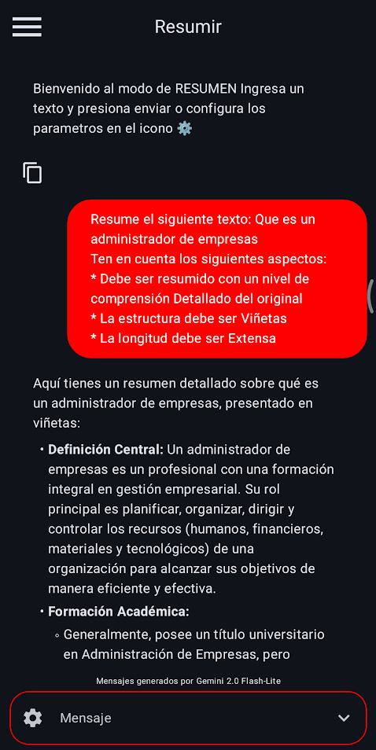
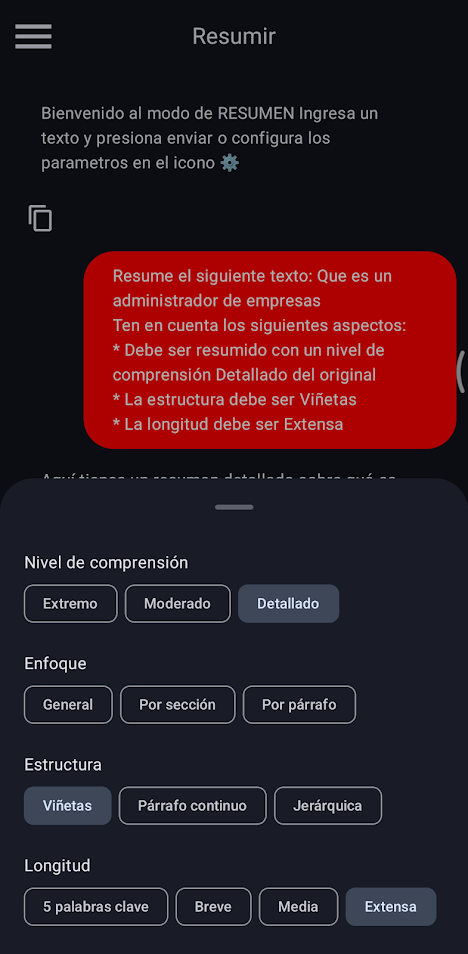

# 📱 Prometeo – Aplicación Móvil Conversacional con IA  

Prometeo es una aplicación móvil desarrollada en **Kotlin con Jetpack Compose** bajo el patrón arquitectónico **MVVM**, que integra la **API de Gemini 2.0 Flash-Lite de Google** para la generación de textos mediante **Inteligencia Artificial Generativa**.  

Su objetivo es **mejorar la experiencia de usuario en la generación de textos**, reduciendo la necesidad de redactar instrucciones complejas gracias a **opciones predefinidas de personalización** (tono, complejidad, estilo, nivel de resumen, etc.).  

Este proyecto forma parte de la tesis:  
**“Desarrollo de una Aplicación Móvil tipo conversacional para Mejorar la Experiencia de Usuario en la Generación de Textos con Inteligencia Artificial”** – Universidad Veracruzana (2025)  

---

## 🚀 Características principales  

- **Tres modos de interacción**:  
  - 🗨️ **Chat** – conversación libre con el modelo Gemini.  
  - ✍️ **Reescribir** – reescritura de textos con parámetros de tono, complejidad y estilo.  
  - 📑 **Resumir** – reducción de textos con parámetros de nivel de compresión, enfoque, estructura y longitud.  

- **Opciones predefinidas** que facilitan la creación de prompts efectivos sin necesidad de conocimientos avanzados.  
- **Modo oscuro** adaptable a las preferencias del sistema.  
- **Copia rápida de resultados** al portapapeles.  
- **Manejo de errores amigable** en caso de fallas con la API.  
- **Compatibilidad con Android 10+**.  

---

## 🛠️ Tecnologías utilizadas  

- **Lenguaje**: Kotlin 
- **UI**: Jetpack Compose
- **Arquitectura**: MVVM
- **API de IA**: Gemini 2.0 Flash-Lite (Google AI)
- **Plataforma**: Android 

---

## 📐 Arquitectura  

La aplicación sigue una arquitectura modular basada en MVVM:  

- **Vista (UI)**: Pantallas construidas en Jetpack Compose (Chat, Reescribir, Resumir).  
- **ViewModel**: Lógica de negocio, gestión de estados y conexión con la API.  
- **Modelo**: Definición de estructuras de datos (mensajes, roles).  
- **Fuente de datos**: Gemini 2.0 Flash-Lite, mediante API REST.  

---

## 📋 Requerimientos funcionales destacados  

- Selección de **modo activo** en pantalla.  
- **Parámetros configurables** en Reescribir (tono, complejidad, estilo).  
- **Parámetros configurables** en Resumir (nivel de compresión, enfoque, estructura, longitud).  
- Mensajes de **espera y error** personalizados.  
- Historial de conversación hasta cierre de la app.  

---

## 📊 Resultados de la evaluación  

Se aplicó una **encuesta a estudiantes de Ingeniería en Tecnologías Computacionales** de la Universidad Veracruzana:  

- ✅ La mayoría consideró que las **opciones predefinidas mejoraron la experiencia de usuario**.  
- ✅ Se destacó la reducción del **esfuerzo cognitivo** y la facilidad de generar instrucciones detalladas.  
- ✅ La aplicación fue considerada adecuada incluso para **personas con poca experiencia tecnológica**.  
- ✅ Un alto porcentaje afirmó que **recomendaría la app a otras personas**.  

---

## 📷 Capturas de pantalla  

| Modo Chat | Modo Reescribir | Modo Resumir |
|-----------|----------------|--------------|
|  |  |  |
| |  |  |

---

## 📦 Instalación y uso  

1. Clonar el repositorio:  
   ```bash
   git clone https://github.com/usuario/prometeo.git
   cd prometeo
2. Abrir el proyecto en Android Studio.

3. Crear un archivo local.properties e incluir la clave de API de Gemini:
   ```bash
    properties
      GEMINI_API_KEY=tu_api_key
4. Ejecutar la aplicación en un dispositivo o emulador con Android 10 o superior.
